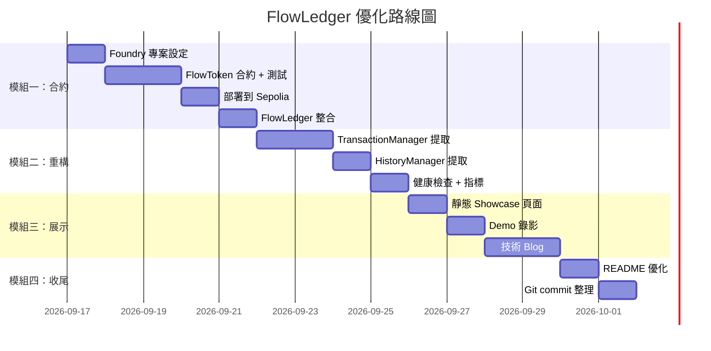

# FlowLedger 全面優化計劃書

## 目標

將 FlowLedger 從「紮實的 side project」提升為「讓面試官印象深刻的 Web3 轉職作品集」。聚焦四個模組，按轉職 ROI 排序。

---

## 模組一：Solidity 合約開發（填補最大缺口）

### 為什麼最優先

面試官目前看到的是「一個會呼叫合約的後端工程師」。加了這個模組後變成「一個從合約到基礎設施都寫的全棧 Web3 開發者」。這一步的投報率最高。

### 具體內容

#### [NEW] `contracts/` -- Foundry 專案

```
contracts/
├── foundry.toml
├── src/
│   └── FlowToken.sol          # 自定義 ERC-20 Token
├── test/
│   └── FlowToken.t.sol        # Foundry 測試
├── script/
│   └── Deploy.s.sol           # 部署腳本
└── README.md                  # 合約文件
```

#### `FlowToken.sol` 設計

不要只寫一個空的 OpenZeppelin 繼承，那太表面了。建議加入以下特性來展示你理解合約開發的實際考量：

```solidity
// SPDX-License-Identifier: MIT
pragma solidity ^0.8.20;

import "@openzeppelin/contracts/token/ERC20/ERC20.sol";
import "@openzeppelin/contracts/access/Ownable.sol";

/// @title FlowToken -- FlowLedger 測試網專用 ERC-20
/// @notice 展示 mint 上限、事件、owner 控制
/// @dev 僅供測試網使用
contract FlowToken is ERC20, Ownable {
    uint256 public constant MAX_SUPPLY = 1_000_000 * 1e18;
    uint256 public constant FAUCET_AMOUNT = 100 * 1e18;

    // 測試水龍頭：每地址每 24 小時可領一次
    mapping(address => uint256) public lastFaucetClaim;

    event FaucetClaim(address indexed recipient, uint256 amount);

    constructor() ERC20("FlowToken", "FLOW") Ownable(msg.sender) {
        _mint(msg.sender, 10_000 * 1e18); // 初始鑄造給部署者
    }

    /// @notice 測試水龍頭，每 24 小時可領取固定數量
    function faucet() external {
        require(
            block.timestamp >= lastFaucetClaim[msg.sender] + 24 hours,
            "FlowToken: 24h cooldown"
        );
        require(
            totalSupply() + FAUCET_AMOUNT <= MAX_SUPPLY,
            "FlowToken: max supply reached"
        );
        lastFaucetClaim[msg.sender] = block.timestamp;
        _mint(msg.sender, FAUCET_AMOUNT);
        emit FaucetClaim(msg.sender, FAUCET_AMOUNT);
    }

    /// @notice Owner 可鑄造，但受 MAX_SUPPLY 限制
    function mint(address to, uint256 amount) external onlyOwner {
        require(
            totalSupply() + amount <= MAX_SUPPLY,
            "FlowToken: max supply reached"
        );
        _mint(to, amount);
    }
}
```

**設計選擇的面試說辭**：
- `MAX_SUPPLY` -- 展示你理解 token economics 的基本約束
- `faucet()` 附 cooldown -- 對應 FlowLedger 現有的測試幣發放機制，形成端到端閉環
- `Ownable` + `mint` -- 展示 access control pattern
- 沒用 `Pausable`、`ERC20Permit` 等 -- 因為這是測試用途，保持簡單不過度設計

#### `FlowToken.t.sol` 測試重點

| 測試名稱 | 驗證什麼 |
|---|---|
| `testFaucetClaimOnce` | 正常領取流程 |
| `testFaucetCooldown` | 24 小時 cooldown 限制 |
| `testFaucetMaxSupply` | 供應量到頂後拒絕 mint |
| `testMintOnlyOwner` | 非 owner 呼叫 revert |
| `testTransferAndApprove` | 標準 ERC-20 行為 |
| `testFuzz_Transfer(uint256)` | Fuzz 測試展示 |

#### FlowLedger 整合

##### [MODIFY] [`internal/wallet/erc20.go`](file:///Users/a861252012/Desktop/folder/code/flowledger/internal/wallet/erc20.go)

在 trusted token 清單中加入部署後的 FlowToken 合約地址。

##### [NEW] `internal/wallet/flowtoken_live_test.go`

唯讀 live test：驗證部署的合約能正確回傳 symbol="FLOW", decimals=18, totalSupply <= MAX_SUPPLY。

##### [MODIFY] [`docs/onchain-acceptance-2026-09-15.md`](file:///Users/a861252012/Desktop/folder/code/flowledger/docs/onchain-acceptance-2026-09-15.md)

加入 FlowToken 部署和轉帳的交易 hash。

#### 驗證計劃

```bash
# Foundry 測試
cd contracts && forge test -vvv

# 部署到 Sepolia
forge script script/Deploy.s.sol --rpc-url $SEPOLIA_RPC_URL --broadcast --verify

# FlowLedger 整合驗證
FLOWLEDGER_LIVE_RPC=https://ethereum-sepolia-rpc.publicnode.com \
  go test ./internal/wallet -run TestFlowTokenReadOnly -v -count=1
```

---

## 模組二：Go 架構重構（展示大型系統拆分能力）

### 2.1 拆分 Service struct

目前 [`Service`](file:///Users/a861252012/Desktop/folder/code/flowledger/internal/wallet/service.go#L25-L39) 承擔太多責任。

```
目前 Service 的責任：
├── Keystore 管理（Create, Import, Backup, ChangePassword）
├── Quote 管理（Quote, 含 exchange/replacement）
├── Send / Retry（簽署 + 廣播 + journal 更新）
├── History（鏈上查核 + 封存）
├── Token 查詢
├── Activity（同步 + 匯入）
├── Scanner（背景同步）
└── CSRF token

重構後：
Service（協調者，保持薄）
├── KeystoreManager（已存在，不改）
├── TransactionManager（新）── Quote + Send + Retry + journal
├── HistoryManager（新）── History + 鏈上查核 + 封存
└── QuoteStore（已存在，不改）
```

#### [NEW] `internal/wallet/transaction.go`

從 `service.go` 提取 `Quote()`, `Send()`, `Retry()` 方法。

```go
// TransactionManager 管理報價、簽署和廣播的完整生命週期。
type TransactionManager struct {
    client       ChainQuoteProvider
    keystore     *KeystoreManager
    quotes       *QuoteStore
    journal      *JournalManager
    sendMu       sync.Mutex
    storageFault *atomic.Bool
}

// Quote 建立報價，綁定 nonce、金額、fee cap。
func (tm *TransactionManager) Quote(ctx context.Context, req *QuoteRequest) (*QuoteResponse, error) {
    // 從 service.go 的 Quote() 搬過來
}

// Send 解密金鑰、簽署、持久化、廣播。
func (tm *TransactionManager) Send(ctx context.Context, quoteID, password string) (*SendResponse, error) {
    // 從 service.go 的 Send() 搬過來
}

// Retry 重新廣播已簽署的原始 bytes。
func (tm *TransactionManager) Retry(ctx context.Context, hash string) (*SendResponse, error) {
    // 從 service.go 的 Retry() 搬過來
}
```

#### [NEW] `internal/wallet/history_manager.go`

從 `service.go` 提取 `History()` 及相關的 refresh 邏輯。

```go
// HistoryManager 處理交易歷史的鏈上查核和封存。
type HistoryManager struct {
    client        *chain.Client
    journal       *JournalManager
    historyMu     sync.Mutex
    historyOffset int
    storageFault  *atomic.Bool
}
```

#### [MODIFY] [`internal/wallet/service.go`](file:///Users/a861252012/Desktop/folder/code/flowledger/internal/wallet/service.go)

`Service` 變成薄的協調層，委派給子 manager：

```go
type Service struct {
    client    *chain.Client
    keystore  *KeystoreManager
    txManager *TransactionManager
    history   *HistoryManager
    csrfToken string
    walletDir string
    lockFile  *os.File
    catalog   *Service
}

func (s *Service) Quote(ctx context.Context, req *QuoteRequest) (*QuoteResponse, error) {
    return s.txManager.Quote(ctx, req)
}

func (s *Service) Send(ctx context.Context, quoteID, password string) (*SendResponse, error) {
    return s.txManager.Send(ctx, quoteID, password)
}

func (s *Service) History(ctx context.Context) (*HistoryResponse, error) {
    return s.history.History(ctx)
}
```

> [!IMPORTANT]
> **重構原則**：所有現有測試必須不修改就通過。Web 層的 handler 呼叫 `ws.Quote()`、`ws.Send()` 等方法簽名不變。這展示的是「refactor without breaking the interface」。

### 2.2 可觀測性基礎

#### [NEW] `internal/web/health.go`

```go
// GET /healthz -- Docker healthcheck 和監控
// 回傳 200 + {"status":"ok","uptime":"2h30m","version":"dev"}

// GET /metrics -- 基本營運指標（JSON）
// 回傳各鏈 RPC 計數、journal 容量、活躍 quote 數量
```

指標內容：

| 指標 | 來源 |
|---|---|
| `uptime` | process 啟動時間 |
| `rpc.requests` / `rpc.failures` | fallback transport 計數器 |
| `journal.count` / `journal.capacity` | JournalManager |
| `quotes.active` | QuoteStore |
| `last_chain_check` | 最後一次成功 `checkNetwork` 時間 |

#### [MODIFY] [`internal/chain/fallback.go`](file:///Users/a861252012/Desktop/folder/code/flowledger/internal/chain/fallback.go)

在 fallback transport 加入 atomic 計數器：

```go
type fallbackTransport struct {
    // 現有欄位...
    requestCount  atomic.Int64
    failureCount  atomic.Int64
    fallbackCount atomic.Int64
}

// Metrics 回傳目前的計數器快照。
func (t *fallbackTransport) Metrics() map[string]int64 {
    return map[string]int64{
        "requests":  t.requestCount.Load(),
        "failures":  t.failureCount.Load(),
        "fallbacks": t.fallbackCount.Load(),
    }
}
```

#### 驗證計劃

```bash
# 重構後全套測試
docker compose run --rm --no-deps app go test -race -count=1 ./...

# healthcheck
curl http://localhost:8090/healthz
# => {"status":"ok","uptime":"..."}

curl http://localhost:8090/metrics
# => {"rpc":{"requests":42,"failures":1},"journal":{"count":13,"capacity":1000},...}
```

---

## 模組三：展示層強化（降低面試官門檻）

### 3.1 靜態 Showcase 頁面

#### [NEW] `docs/showcase/index.html`

一個不需要 Docker 就能看的靜態頁面，部署到 GitHub Pages：

| 區塊 | 內容 |
|---|---|
| Hero | 專案名稱 + 一句話定位 + Demo Video 嵌入 |
| Architecture | Mermaid 圖（直接從 architecture.md 拿） |
| On-chain Evidence | 13+ 筆交易的表格，連結到 block explorer |
| Smart Contract | FlowToken 合約地址 + Etherscan 連結 |
| Test Coverage | CI badge + 測試比例數據 |
| Design Decisions | 3-4 個核心決策的精簡說明 |

#### [NEW] `.github/workflows/pages.yml`

```yaml
name: Deploy Showcase
on:
  push:
    branches: [main]
    paths: ['docs/showcase/**']
permissions:
  pages: write
  id-token: write
jobs:
  deploy:
    runs-on: ubuntu-latest
    steps:
      - uses: actions/checkout@v4
      - uses: actions/configure-pages@v4
      - uses: actions/upload-pages-artifact@v3
        with:
          path: docs/showcase
      - uses: actions/deploy-pages@v4
```

### 3.2 Demo 錄影

用 FlowLedger 的實際操作錄一段 **2-3 分鐘** 的 demo video：

| 時間 | 內容 |
|---|---|
| 0:00-0:15 | 建立錢包 + 助記詞展示 |
| 0:15-0:30 | 切換 EVM 網路 |
| 0:30-0:50 | 查詢餘額 + FlowToken 資訊 |
| 0:50-1:20 | ETH 轉帳完整流程（報價 -> 確認 -> 送出） |
| 1:20-1:50 | Uniswap 兌換流程 |
| 1:50-2:10 | TRON / Solana 錢包展示 |
| 2:10-2:30 | 交易歷史 + 鏈上驗證 |

放在 README 最上方，連結到 YouTube。

### 3.3 技術 Blog

#### [NEW] `docs/blog-web3-transition.md`

標題：「從 PHP/Laravel 八年後端到 Go 多鏈錢包：Web3 轉職的工程思維」

大綱：
1. **動機**：Web2 後端工程師看到的 Web3 技術差異
2. **語言選擇**：為什麼是 Go（並發模型、geth 生態、標準庫）
3. **三個最難的技術挑戰**：
   - journal-before-broadcast：從資料庫事務到檔案系統原子操作
   - 多鏈簽署差異：secp256k1 vs Ed25519 vs TRON protobuf
   - Uniswap V3 整合：ABI encoding + multicall + slippage
4. **PHP 經驗帶來的價值**：事務性思維、錯誤處理、backward compatibility
5. **下一步**：Solidity + Foundry + 可能的 Rust

發在 dev.to 或 Medium，連結放在 README 和 LinkedIn。

---

## 模組四：Git 歷史與 README

### 4.1 Git Commit 策略

> [!WARNING]
> **不要重寫歷史來偽造 commit 數量**。那更糟，日期和內容會不一致。

正確做法：從現在開始，每個優化步驟用有意義的 conventional commit：

```
feat(contracts): add FlowToken ERC-20 with faucet and supply cap
test(contracts): add Foundry tests including fuzz for FlowToken
deploy(contracts): deploy FlowToken to Sepolia at 0x...

refactor(wallet): extract TransactionManager from Service
refactor(wallet): extract HistoryManager from Service
feat(web): add /healthz and /metrics endpoints
feat(chain): add request counters to fallback transport

docs: add static showcase page for GitHub Pages
docs: add Web3 transition blog post
ci: add GitHub Pages deployment workflow
```

### 4.2 README 優化

#### [MODIFY] [`README.md`](file:///Users/a861252012/Desktop/folder/code/flowledger/README.md)

在最上方加入速覽區塊：

```markdown
## Quick Overview

[2-min Demo](YouTube連結) | [Live Showcase](https://a861252012.github.io/flowledger/) | [Blog: Web3 Transition](連結)

**FlowLedger** -- Go 本機多鏈測試網錢包，展示交易簽署、故障復原與鏈狀態追蹤。

### Highlights
- Journal-before-broadcast: crash-safe 交易持久化
- 7 條鏈: EVM x5 + Solana Devnet + TRON Shasta
- 自部署 ERC-20 合約 (FlowToken) + Foundry 測試
- Uniswap V3 整合: wrap/unwrap/swap 雙向完整流程
- 13+ 筆真實測試網交易附 block explorer 驗證
- 83% 測試覆蓋比 + race detector + CI
```

---

## 工作順序



## 完整驗證清單

### 自動化測試
```bash
# Go 全套測試（重構後必須全過）
docker compose run --rm --no-deps app go test -race -count=1 ./...
docker compose run --rm --no-deps app go vet ./...

# Foundry 合約測試
cd contracts && forge test -vvv

# 瀏覽器測試
npm test --prefix tests/browser

# Python 鏈上驗證（加入 FlowToken 交易後需更新）
python3 scripts/verify_onchain_evidence.py
```

### 手動驗證
- [ ] 用 FlowLedger 查詢 FlowToken 餘額
- [ ] 用 FlowLedger 轉帳 FlowToken 並確認 receipt
- [ ] `/healthz` 回傳 200 + 正確 JSON
- [ ] `/metrics` 回傳 RPC 計數和 journal 容量
- [ ] GitHub Pages showcase 頁面正常顯示
- [ ] Demo video 涵蓋所有主要流程
- [ ] Blog 在 dev.to 發布且 README 有連結

---

## Open Questions

> [!IMPORTANT]
> **1. Foundry 部署的 private key 管理**
>
> 部署腳本需要 private key。測試網可以用 `--private-key` 環境變數，但建議用 `cast wallet` 建立專用部署帳戶。你有偏好嗎？

> [!IMPORTANT]
> **2. FlowToken 的複雜度**
>
> 目前設計是 ERC-20 + faucet + supply cap。要加更多功能嗎（如 staking、vesting、permit）？建議保持目前範圍：簡單但有獨特性，避免面試時被問到你不熟的 DeFi 機制。

> [!IMPORTANT]
> **3. Blog 發布平台**
>
> dev.to（開發者社群曝光高）、Medium（一般受眾廣）、還是個人網站？

> [!IMPORTANT]
> **4. 重構的測試策略**
>
> Service 拆分後，現有測試檔案要跟著拆嗎？建議先不拆：現有測試全過證明 refactor 沒 break interface，這本身就是展示重點。新加的 manager 可以各自寫單元測試。
